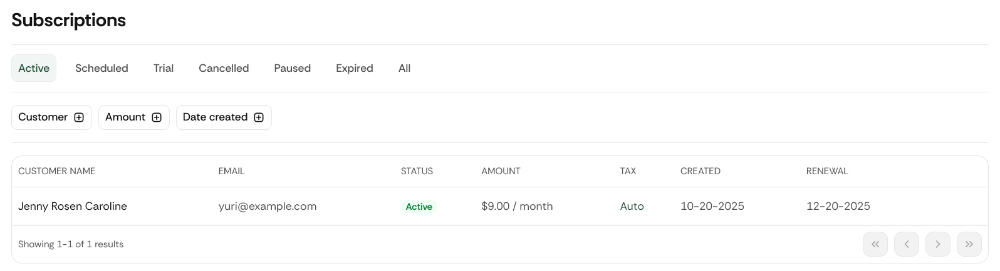

# Subscriptions

The **Subscriptions** section in the left navigation panel allows business users to view, filter, and manage all subscription records in their ChaChing tenant.

When you click **Subscriptions**, you will see a filter panel and a subscription table listing all relevant subscription data.

## 1. Status Filters

The top row of filters allows you to quickly filter subscriptions by lifecycle state.

| **Filter** | **Description** |
| --- | --- |
| **Active** | Displays currently active subscriptions that are billing on schedule. |
| **Scheduled** | Shows subscriptions that are set to start in the future. |
| **Trial** | Shows subscriptions that are in a trial period. |
| **Cancelled** | Shows subscriptions that have been cancelled and will not renew. |
| **Paused** | Shows subscriptions temporarily paused. |
| **Expired** | Shows subscriptions that reached their end date and expired. |
| **All** | Displays all subscriptions regardless of status. |

## 2. Additional Filters

Below the status filters, a set of advanced filters is shown. Each filter has its own input fields and an **Apply** button.

### Customer Filter

| **Element** | **Description** |
| --- | --- |
| **Customer (dropdown)** | Allows selecting a specific customer by name. |
| **Apply** | Applies the customer filter to narrow down the subscription list. |

### Amount Filter

| **Option** | **Description** |
| --- | --- |
| **Is equal to** | Show subscriptions with the exact specified amount. |
| **Between** | Show subscriptions within a specified minimum and maximum amount. |
| **Greater than** | Show subscriptions with an amount above a chosen value. |
| **Less than** | Show subscriptions with an amount below a chosen value. |

Each option displays input fields dynamically based on the selection.

An **Apply** button narrows down the subscription list.

### Date Created Filter

| **Option** | **Description** |
| --- | --- |
| **In the last** | Filter subscriptions created within a timeframe (e.g., last 7, 30, 90 days). |
| **Is equal to** | Filter subscriptions created on a specific date. |
| **Between** | Select a date range. |
| **On or After** | Show subscriptions created from a certain date forward. |
| **Before or on** | Show subscriptions created before (or up to) a certain date. |

Each option displays input fields dynamically based on the selection.

An **Apply** button narrows down the subscription list.

## 3. Subscription Table

Below the filters, all matching subscriptions are displayed in a table.

### Table Columns

| **Column** | **Description** |
| --- | --- |
| **Customer Name** | The name of the customer associated with each subscription. |
| **Email** | Customer’s email used for receipts and notifications. |
| **Status** | Current subscription status (Active, Scheduled, Trial, etc.). |
| **Amount** | Billing amount for the subscription. |
| **Tax** | Tax amount associated with the subscription. |
| **Created** | Date the subscription was created. |
| **Renewal** | Next charge or renewal date. |

## 4. Row Actions

Each subscription row includes a **menu** on the right side.

When clicked, the menu provides:

| **Action** | **Description** |
| --- | --- |
| **View Subscription Details** | Opens the detailed view of the subscription. |
| **View Customer Details** | Redirects to the associated customer’s full profile. |

These actions allow quick navigation between subscription and customer records.