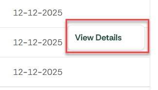

# Transactions

When the user clicks **Transactions** in the left navigation panel, the system displays filtering options and a results table showing all payment transactions.

## Filter Tabs

| **Tab** | **Description** |
| --- | --- |
| **All** | Shows all transactions regardless of status. |
| **Succeeded** | Filters to only successful transactions. |
| **Refunded** | Filters to only refunded transactions. |
| **Failed** | Filters to only failed transactions. |

## Additional Filters

### Status Filter

| **Field** | **Description** |
| --- | --- |
| **Checkbox list** | Options: *Succeeded, Refunded, Failed*. User may select one or multiple. |
| **Apply button** | Applies the selected status filters to the table. |

### Date Filter

| **Field** | **Description** |
| --- | --- |
| **Date filter type** | Dropdown with: *In the last, Is equal to, Between, On or After, Before or on*. |
| **Dynamic input fields** | Fields change depending on selected date filter type (e.g., single date, date range, number of days). |
| **Apply button** | Filters the results using the selected date criteria. |

### Customer Filter

| **Field** | **Description** |
| --- | --- |
| **Customer** | Dropdown list of all customers. |
| **Apply button** | Filters transactions belonging to the chosen customer. |

### Amount Filter

| **Field** | **Description** |
| --- | --- |
| **Amount condition** | Dropdown with: *Is equal to, Between, Greater than, Less than*. |
| **Dynamic input fields** | Numeric field(s) that adjust depending on selected condition. |
| **Apply button** | Applies the amount-based filter to the table. |

## Export Options

Exports the transactions list. When filters are applied, exports only selected transactions . For details, refer to 

| **Format** | **Description** |
| --- | --- |
| **CSV** | Exports all currently filtered transactions as a CSV file. |
| **XLSX** | Exports the data as an Excel spreadsheet. |

# Transactions Table

Displayed below the filters.

| **Column** | **Description** |
| --- | --- |
| **Amount** | Total transaction amount. |
| **Status** | Transaction status (e.g., *Succeeded, Refunded, Failed*). |
| **Customer Name** | Name of the customer associated with the transaction. |
| **Payment method** | The card or payment source used (e.g., *Visa •••• 4242*). |
| **Email Address** | Customer’s email address. |
| **Date** | Date and time of the transaction. |
| **Action** | Contains a **View Details** link. Opens the Transaction Details page. |

### Transactions Details

Clicking the three dots in a transactions row opens a detailed transactions details.

| **Field** | **Description** |
| --- | --- |
| **Amount** | The attempted transaction amount. |
| **Status** | The detailed internal status (e.g., *PURCHASE_ERRORED*). |
| **Timeline** | Step-by-step history such as *Payment started*, *Payment failed*, with timestamps. |
| **Error message** | Shows reason for failure when applicable. |
| **Last update** | Timestamp of the last system update for this payment. |
| **Customer** | Customer associated with the payment. |
| **Payment ID** | Unique identifier for this payment attempt. |
| **Payment method** | Details of the payment method used (e.g., *Visa •••• 4242*). |